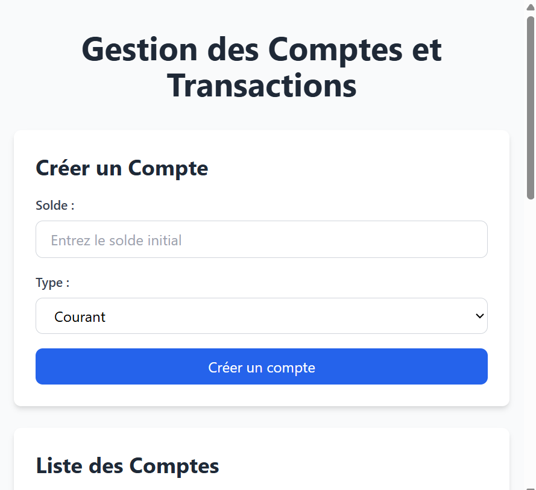
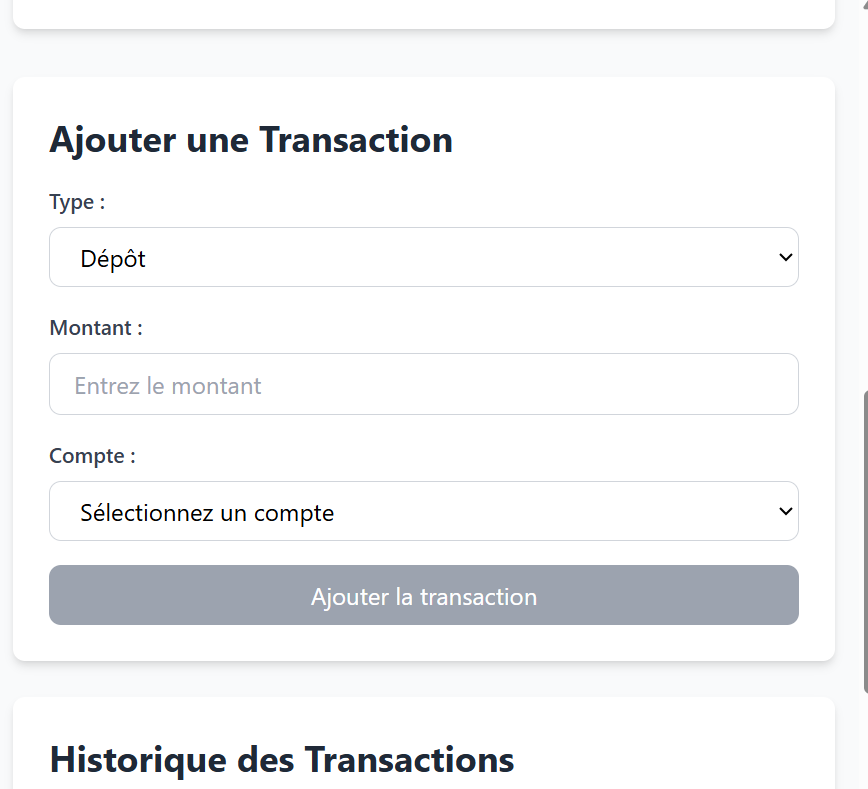

## Account and Transaction Management Interface

The following screenshots illustrate the main features of the application,
developed using **React**, **GraphQL**, and **Apollo Client**.

---

###  Create a Bank Account

This section allows the user to create a new bank account by specifying:
- The initial balance
- The account type (e.g. Current account)

Once submitted, a GraphQL mutation is sent to the backend to persist the account.

---

###  Add a Transaction

This section enables the user to add a transaction to an existing account:
- Transaction type (Deposit or Withdrawal)
- Transaction amount
- Target account

The transaction is handled via a GraphQL mutation and the account balance is
updated accordingly.

---

###  Transaction History

The application also displays the transaction history, allowing users to track
all operations performed on their accounts in real time.
